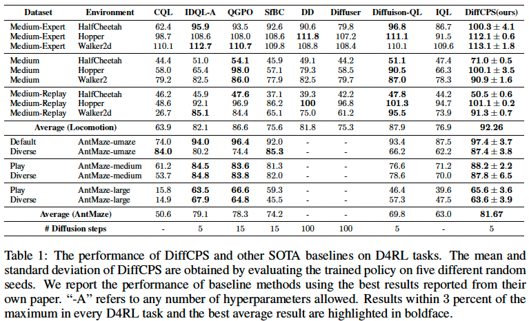

# Diffusion Model Based Constrained Policy Search (DiffCPS)
This is the official pytorch implementation of our paper:Diffusion Model Based Constrained Policy Search for Offline Reinforcement Learning
## Abstract
Constrained policy search (CPS) is a fundamental problem in offline reinforcement learning, which is generally solved by advantage weighted regression (AWR). However, previous methods may still encounter out-of-distribution actions due to the limited expressivity of Gaussian-based policies.  On the other hand, directly applying the state-of-the-art models with distribution expression capabilities (i.e., diffusion models) in the AWR framework is insufficient since AWR requires exact policy probability densities, which is intractable in diffusion models. In this paper, we propose a novel approach called **Diffusion Model based Constrained Policy Search (DiffCPS)**, which tackles the diffusion-based constrained policy search without resorting to AWR.  The theoretical analysis reveals our key insights by leveraging the action distribution of the diffusion model to eliminate the policy distribution constraint in the CPS and then utilizing the Evidence Lower Bound (ELBO) of diffusion-based policy to approximate the KL constraint. Consequently, DiffCPS admits the high expressivity of diffusion models while circumventing the cumbersome density calculation brought by AWR. Extensive experimental results based on the D4RL benchmark demonstrate the efficacy of our approach. We empirically show that DiffCPS achieves better or at least competitive performance compared to traditional AWR-based baselines as well as recent diffusion-based offline RL methods. Code will be made publicly available upon acceptance.

If you find this work is helpful for your research, please cite us with the following BibTex entry:
```
@article{he2023diffcps,
    title={DiffCPS: Diffusion Model based Constrained Policy Search for Offline Reinforcement Learning}, 
    author={Longxiang He and Linrui Zhang and Junbo Tan and Xueqian Wang},
    journal={arxiv preprint arXiv:2310.05333},
    year={2023}
}
```
## Requirements
```
pip install -r requirements.txt
```

## Quick Start
```
python run.py --env_name halfcheetah-medium-v2 --device 0  --lr_decay 
```

