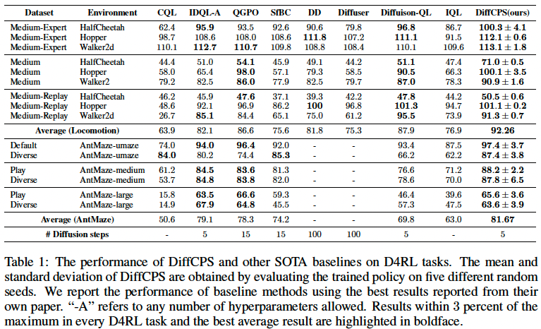

# Diffusion-based Constrained Policy Search (DiffCPS)
This is the official Pytorch implementation of our paper: Diffusion-based Constrained Policy Search for Offline Reinforcement Learning
## Abstract
Offline reinforcement learning, which aims to learn the optimal policy in the pre-collected data (offline data) and avoids sample-inefficient and risky environmental interactions, has recently attracted great attention. The main difficulty of offline RL lies in the trade-off between distribution shift and reward maximization. This problem can be solved through advantage-weighted regression (AWR), which formulates offline RL as an optimization problem (known as Constrained policy search \textit{CPS}) and gets the closed-form solution of CPS. However, AWR  represents policy with  Gaussian distribution, which may produce out-of-distribution actions due to the limited expressivity of Gaussian-based policies.  On the other hand, directly applying the state-of-the-art models with distribution expression capabilities (i.e., diffusion models) in the AWR framework has two problems: 1) AWR's closed solution requires exact policy probability densities, which is intractable in diffusion models; 2) the computational inefficiency of the diffusion model. To address the problem of requiring exact policy probability densities in AWR, we propose Diffusion-based Constrained Policy Search (DiffCPS) which directly solves the \textit{CPS} problem using the primal-dual method, rather than resorting to AWR's closed solution. To solve the computational inefficiency of diffusion-based policy, we employ a diffusion distillation method to distill the diffusion-based policy into a single-step policy. Our theoretical results show that after at most $\mathcal{O}(1/\varepsilon)$ number of dual iterations, where $\varepsilon$ denotes the desired solution accuracy, the lower bound and upper bound of error between the approximated solution of DiffCPS and the optimal solution linearly depends on policy expressivity $\epsilon$ and desired solution accuracy $\varepsilon$ respectively. Our experimental results show that DiffCPS achieves better or at least competitive performance compared to traditional AWR-based baselines as well as recent diffusion-based offline RL methods on the D4RL tasks.

If you find this work is helpful for your research, please cite us with the following BibTex entry:
```
@article{he2023diffcps,
    title={DiffCPS: Diffusion Model based Constrained Policy Search for Offline Reinforcement Learning}, 
    author={Longxiang He and Linrui Zhang and Junbo Tan and Xueqian Wang},
    journal={arxiv preprint arXiv:2310.05333},
    year={2023}
}
```
## Requirements
```
pip install -r requirements.txt
```

## Quick Start
```
python run.py --env_name halfcheetah-medium-v2 --device 0  --lr_decay 
```

